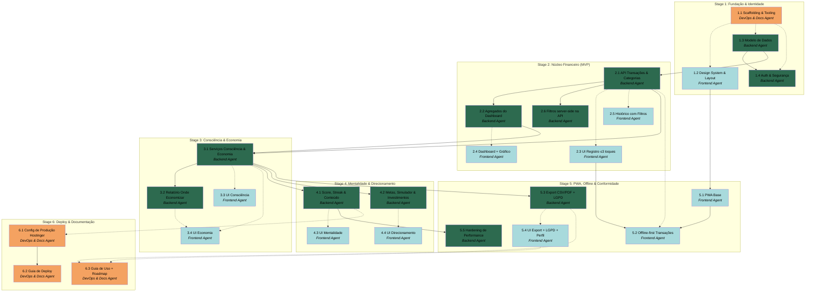

# APM Plan

## Workers

| Worker | Domain | Description |
|---|---|---|
| Backend Agent | Laravel / servidor | Modelo de dados, migrations/seeders, autenticação e segurança, endpoints JSON, serviços de regra de negócio (Score, orçamentos, recorrentes, "onde economizar"), filas e scheduler, export, LGPD e performance de consultas. |
| Frontend Agent | Cliente (UI + PWA) | Blade/Tailwind/Alpine/Chart.js: design system, layout mobile-first, todas as telas, gráficos, feedback visual, e o PWA com sincronização offline. |
| DevOps & Docs Agent | Infra & documentação | Scaffolding do Laravel/tooling, configuração de produção da Hostinger (cron, .htaccess/Gzip, env), e documentos finais (guia de deploy, guia de uso, roadmap). |

## Stages

| Stage | Name | Tasks | Agents |
|---|---|---|---|
| 1 | Fundação & Identidade | 4 | DevOps & Docs, Frontend, Backend |
| 2 | Núcleo Financeiro (MVP) | 6 | Backend, Frontend |
| 3 | Consciência & Economia | 4 | Backend, Frontend |
| 4 | Mentalidade & Direcionamento | 4 | Backend, Frontend |
| 5 | PWA, Offline & Conformidade | 5 | Frontend, Backend |
| 6 | Deploy & Documentação | 3 | DevOps & Docs |

## Dependency Graph

---

> **Notes:** Observações sobre a estrutura de trabalho, para a coordenação do Manager:
> - **Stages sequenciais, paralelismo dentro do Stage.** Cada Stage abre frentes paralelas Backend/Frontend assim que a dependência cross-agent é satisfeita. O Manager pode despachar a UI de um Stage em paralelo ao backend do mesmo Stage respeitando as arestas pontilhadas.
> - **Caminho crítico.** Está no Backend: 1.3 → 2.1 → 2.2 → 3.1 → 4.1. Atrasos aqui propagam para a UI dependente. A cadeia same-agent 2.1→2.2→3.1→3.2 e 4.1/4.2 são candidatos a batch.
> - **Marco de MVP utilizável ao fim do Stage 2.** Dado o prazo (02/07, ~9 dias a partir de 23/06) e a prioridade do usuário por acabamento sobre quantidade, vale uma verificação holística de ponta a ponta ao fim do Stage 2 (registrar → ver no dashboard/gráfico/histórico) antes de avançar. Stages 3–5 agregam em camadas; se o tempo apertar, o roadmap (Task 6.3) documenta o que faltar. **Contingência de prazo:** o prazo é de alto risco para 24 Tasks em 6 Stages sequenciais; o Manager deve estar preparado para declarar o Stage 2 (MVP) como a entrega principal e empacotar Stages 3–5 no roadmap se não couberem no tempo.
> - **Verificação holística.** As validações por Task são Worker-scoped. Verificações de ponta a ponta (fluxo completo de uso, performance <2–3s no dashboard, offline-sync real) são responsabilidade de runtime do Manager — boas fronteiras para isso são o fim dos Stages 2 e 5.
> - **Etapas que exigem o usuário (não-técnico).** Configuração de SMTP da Hostinger (1.4), domínio/SSL e cron (6.1), conexão do remoto GitHub/GitFlow, e validações visuais guiadas em várias Tasks de Frontend. O Manager deve enriquecer os Task Prompts com instruções passo a passo em linguagem leiga e marcar os pontos de pausa para ação/validação do usuário.
> - **Offline-sync.** A Task 5.2 é o requisito inegociável de zero perda de dados. Depende dos endpoints JSON (2.1) e da UI de transação (2.3); convém validá-la de forma guiada com o usuário (registrar offline e ver sincronizar).

## Stage 1: Fundação & Identidade

### Task 1.1: Scaffolding & Tooling - DevOps & Docs Agent

* **Objective:** Criar um projeto Laravel funcional com todo o tooling de frontend e a base de configuração da hospedagem compartilhada.
* **Output:** Projeto Laravel instalado e rodando; Laravel Breeze (stack Blade) instalado; Tailwind CSS + Vite + Alpine.js + Chart.js instalados e compilando; `.env` configurado para cache em arquivo e fila no banco; SVGs de marca reorganizados em assets públicos (ex.: `public/img/brand/`) preservando os originais.
* **Validation:** `php artisan serve` sobe a aplicação; rotas de login/registro do Breeze renderizam; `npm run build`/Vite compila Tailwind sem erro; `php artisan migrate` roda as migrations padrão do Breeze.
* **Guidance:** Stack e drivers conforme as seções "Arquitetura e Stack Técnica" e "Runtime e Restrições de Hospedagem" da Spec (Breeze Blade, cache `file`, fila `database`). Mobile-first desde o início. Não customizar auth aqui (isso é a Task 1.4). Manter os SVGs originais e referenciar a partir dos assets.
* **Dependencies:** None

1. Instalar o Laravel e inicializar o projeto na raiz `C:\_PROJETOS\FlowFin\`.
2. Instalar o Laravel Breeze com stack Blade (inclui Tailwind e Vite).
3. Instalar e registrar o Alpine.js e o Chart.js (`npm install chart.js`) no pipeline do Vite.
4. Configurar `.env` para `CACHE_STORE=file` e `QUEUE_CONNECTION=database`; publicar a migration da tabela de filas.
5. Mover `logo_flowfin.svg` e `icon_flowfin.svg` para a estrutura de assets públicos, preservando os arquivos.
6. Validar build (Vite) e subida da aplicação.

### Task 1.2: Design System & Layout Base - Frontend Agent

* **Objective:** Estabelecer a identidade visual e o layout base mobile-first reutilizados por todas as telas.
* **Output:** Tema Tailwind com a paleta e a fonte Inter; layout base (app shell + navegação mobile-first); biblioteca de componentes reutilizáveis (cards, inputs, botões, toasts de feedback, barra de progresso, badges semafóricos); marca (logo/ícone) integrada.
* **Validation:** Componentes renderizam em uma página de demonstração; paleta e tipografia conferem com a Spec; layout responde corretamente em viewport mobile e desktop (validação visual guiada com o usuário).
* **Guidance:** Cores, tipografia e padrões de UX conforme a seção "Identidade Visual e Padrões de UX" da Spec. Configurar Inter e os gradientes azul/verde como tokens do tema Tailwind. Componente de toast deve servir ao padrão de "feedback visual imediato". Estilo clean/minimalista, sem poluição.
* **Dependencies:** **Task 1.1 by DevOps & Docs Agent** (projeto e Tailwind/Vite configurados).

1. Configurar o tema Tailwind com paleta, gradientes, cores semafóricas e fonte Inter.
2. Construir o layout base (app shell, header/nav mobile-first, área de conteúdo).
3. Criar os componentes Blade/Alpine reutilizáveis (cards, inputs, botões, toast de feedback, barra de progresso, badge semafórico).
4. Integrar logo e ícone da marca.
5. Montar uma página de demonstração dos componentes e validar visualmente com o usuário.

### Task 1.3: Modelo de Dados, Migrations & Seeders - Backend Agent

* **Objective:** Definir o schema completo do banco com integridade, índices e dados iniciais.
* **Output:** Migrations para todas as entidades (perfil de usuário com renda estimada, categorias, transações, orçamentos, metas, recorrências, investimentos, conteúdo educativo); Models Eloquent com soft deletes e relacionamentos escopados por usuário; seeder das 9 categorias pré-definidas (com ícone e cor).
* **Validation:** `php artisan migrate:fresh --seed` roda sem erro; as 9 categorias são populadas; valores monetários são colunas inteiras (centavos); índices presentes em `user_id`, `category_id`, `date`, `type`; soft deletes funcionam.
* **Guidance:** Seguir a seção "Modelo de Dados e Integridade" da Spec (centavos como inteiro, soft deletes, índices, escopo por usuário) e a estrutura de "Transação" e "Categorias pré-definidas" ali descritas. Não expor endpoints aqui (isso é a Task 2.1).
* **Dependencies:** **Task 1.1 by DevOps & Docs Agent** (projeto Laravel).

1. Modelar e criar migrations de todas as entidades, com colunas monetárias em centavos, soft deletes e índices.
2. Criar os Models Eloquent com relacionamentos e escopo por `user_id`.
3. Adicionar campo de renda mensal estimada ao perfil do usuário.
4. Criar o seeder das 9 categorias pré-definidas com ícone e cor.
5. Rodar `migrate:fresh --seed` e validar schema e dados.

### Task 1.4: Autenticação & Segurança - Backend Agent

* **Objective:** Entregar autenticação completa e segura com verificação de e-mail, recuperação de senha e proteções.
* **Output:** Verificação de e-mail e recuperação de senha funcionando via SMTP da Hostinger; rate limiting nas rotas sensíveis; tela/edição de perfil com renda estimada.
* **Validation:** Fluxos de registro, login, verificação de e-mail e recuperação de senha funcionam (validação guiada com credenciais SMTP do usuário); rate limiting bloqueia tentativas excessivas; perfil salva a renda.
* **Guidance:** Conforme a seção "Autenticação e Segurança" da Spec. Customizar o Breeze instalado na Task 1.1; usar os campos de perfil da Task 1.3. O envio real de e-mail depende das credenciais SMTP do usuário — incluir passo de coordenação para o usuário fornecer/configurar e validar.
* **Dependencies:** **Task 1.1 by DevOps & Docs Agent**, Task 1.3.

1. Habilitar e ajustar verificação de e-mail e recuperação de senha do Breeze.
2. Configurar o mailer SMTP da Hostinger no `.env` (com o usuário fornecendo as credenciais — passo de coordenação).
3. Aplicar rate limiting em login, registro e recuperação.
4. Implementar edição de perfil com renda mensal estimada.
5. Validar os fluxos de e-mail de forma guiada com o usuário.

## Stage 2: Núcleo Financeiro (MVP)

### Task 2.1: API de Transações & Categorias - Backend Agent

* **Objective:** Expor os endpoints JSON de transações e categorias que sustentam o registro e a leitura de dados financeiros.
* **Output:** Endpoints JSON autenticados por sessão para CRUD de transações (tipo entrada/saída, valor em centavos, categoria, data, descrição opcional, necessidade/desejo, marcação de recorrência) e CRUD de categorias personalizadas; validação de entrada; soft delete.
* **Validation:** Feature tests (PHPUnit) cobrindo criação, edição, listagem, exclusão (soft) e validação passam; valores persistidos em centavos; dados escopados ao usuário autenticado.
* **Guidance:** Endpoints JSON conforme a seção "Arquitetura e Stack Técnica" da Spec (operações críticas via JSON para suportar offline). Usar os Models da Task 1.3. Estes endpoints são consumidos pela UI (Stage 2 Frontend) e pela camada offline (Task 5.2) — manter contrato de payload estável e documentado nos comentários.
* **Dependencies:** Task 1.3.

1. Definir rotas e controllers JSON para transações.
2. Implementar validação (FormRequest) e conversão para centavos.
3. Implementar CRUD de categorias personalizadas (mantendo as pré-definidas do seeder).
4. Garantir escopo por usuário e soft delete.
5. Escrever feature tests dos endpoints.

### Task 2.2: Serviço de Agregados do Dashboard - Backend Agent

* **Objective:** Calcular e servir, com cache, os agregados mensais do dashboard.
* **Output:** Serviço/endpoint que retorna entrou/saiu/sobrou do mês, resumo por categoria e % necessidade vs. desejo; cache dos agregados invalidado ao registrar/editar/excluir transação.
* **Validation:** Testes dos cálculos com cenários conhecidos passam; o cache é invalidado corretamente após mutação de transação.
* **Guidance:** Seguir os requisitos de performance da Spec (cache de agregados, eager loading). Reaproveitar os Models/endpoints da Task 2.1. Cálculo de % necessidade/desejo conforme a regra na Spec.
* **Dependencies:** Task 2.1.

1. Implementar o serviço de agregados mensais (totais, por categoria, necessidade/desejo).
2. Adicionar cache em arquivo dos agregados com chave por usuário/mês.
3. Invalidar o cache em mutações de transação.
4. Expor endpoint JSON para o dashboard.
5. Escrever testes dos cálculos e da invalidação.

### Task 2.3: UI Registro de Transação (≤3 toques) & Categorias - Frontend Agent

* **Objective:** Permitir registrar uma transação em no máximo 3 toques e gerenciar categorias personalizadas.
* **Output:** Tela/fluxo de registro rápido (valor → categoria → salvar) com feedback de salvamento; gestão de categorias personalizadas (criar/editar/excluir); estados de erro e loading.
* **Validation:** Registrar uma saída/entrada em ≤3 toques e vê-la confirmada ("Transação registrada ✓") — validação visual guiada; erros de validação exibidos claramente.
* **Guidance:** Consumir os endpoints da Task 2.1. Aplicar os componentes e o feedback visual da Task 1.2 e o padrão de "≤3 toques" da Spec. Linguagem humana (entrada/saída). Preparar o fluxo de escrita de forma que a Task 5.2 possa interceptá-lo para a fila offline.
* **Dependencies:** **Task 2.1 by Backend Agent**, Task 1.2.

1. Construir o formulário de registro rápido (valor, categoria, tipo, necessidade/desejo) otimizado para ≤3 toques.
2. Integrar com os endpoints JSON e exibir feedback de salvamento.
3. Implementar gestão de categorias personalizadas.
4. Tratar estados de erro e loading.
5. Validar o fluxo de 3 toques de forma guiada com o usuário.

### Task 2.4: Dashboard do Mês + Gráfico de Categorias - Frontend Agent

* **Objective:** Apresentar a visão clara do mês com resumo e gráfico de categorias.
* **Output:** Dashboard com cards entrou/saiu/sobrou do mês, gráfico de rosca (Chart.js) por categoria e % necessidade vs. desejo.
* **Validation:** Dashboard exibe os valores corretos vindos dos agregados; gráfico renderiza; carrega em <2–3s (validação guiada no celular).
* **Guidance:** Consumir o endpoint da Task 2.2. Usar Chart.js conforme a Spec; formatação em R$ (padrão brasileiro). Aplicar o design system da Task 1.2.
* **Dependencies:** **Task 2.2 by Backend Agent**, Task 1.2.

1. Construir os cards de resumo mensal (entrou/saiu/sobrou).
2. Integrar o gráfico de rosca por categoria (Chart.js).
3. Exibir o % necessidade vs. desejo.
4. Aplicar formatação monetária brasileira.
5. Validar visualmente e checar tempo de carregamento.

### Task 2.5: Histórico com Filtros - Frontend Agent

* **Objective:** Listar transações com filtros e edição/exclusão.
* **Output:** Lista paginada (20/página) com filtros por período, categoria e tipo; ações de editar e excluir.
* **Validation:** Filtros retornam os resultados corretos; paginação funciona; editar/excluir refletem na lista e no dashboard.
* **Guidance:** Consumir os endpoints da Task 2.1. Paginação conforme requisitos de performance da Spec. Reusar componentes da Task 1.2.
* **Dependencies:** **Task 2.1 by Backend Agent**, Task 1.2.

1. Construir a lista paginada de transações.
2. Implementar filtros por período, categoria e tipo.
3. Implementar edição e exclusão (soft) com feedback.
4. Validar filtros, paginação e consistência com o dashboard.

### Task 2.6: Filtros server-side na API de Transações - Backend Agent

* **Objective:** Habilitar filtragem no servidor na listagem de transações, fechando a lacuna identificada na Task 2.5 (a UI de histórico já envia os parâmetros, mas o `index` não os lê).
* **Output:** `GET /api/transactions` aceita e aplica `date_from`, `date_to` (período por data), `category_id` e `type` (entrada/saída), mantendo a paginação de 20/página, o eager loading da categoria e o escopo por usuário; combinações de filtros funcionam; `meta` reflete o total filtrado.
* **Validation:** Feature tests cobrindo cada filtro isolado e combinado, paginação preservada sobre o conjunto filtrado, e escopo por usuário; parâmetros inválidos tratados (validação).
* **Guidance:** Esta Task surgiu do achado da Task 2.5 (`task-02-05.log.md`): o `TransactionController@index` apenas paginava (`latest('date')->paginate(20)`) sem ler query params. A UI de histórico já envia exatamente `date_from`, `date_to`, `category_id`, `type` — manter esse contrato para encaixe imediato. Reusar os padrões da Task 2.1 (escopo por usuário, `Accept: application/json`, eager loading). Validar os parâmetros (datas, enum de tipo, existência/escopo da categoria).
* **Dependencies:** Task 2.1.

1. Adicionar leitura e validação dos query params no `index` (FormRequest ou validação inline).
2. Aplicar os filtros à query escopada por usuário, preservando `with('category')` e `paginate(20)`.
3. Escrever feature tests dos filtros (isolados, combinados, paginação, escopo).

## Stage 3: Consciência & Economia

### Task 3.1: Serviços de Consciência & Economia - Backend Agent

* **Objective:** Fornecer os dados e regras de consciência e economia que alimentam as telas do Stage 3.
* **Output:** Lógica e endpoints para: transações recorrentes (contas fixas), top 3 maiores gastos, linha do tempo diária, comparativo mês a mês, orçamentos por categoria com status (80%/100%), meta de economia mensal com progresso, detector de gastos "invisíveis" (recorrentes/assinaturas agrupados). Cache onde aplicável.
* **Validation:** Testes dos cálculos (top 3, comparativo, status de orçamento 80/100, progresso de meta, agrupamento de invisíveis) passam com cenários conhecidos.
* **Guidance:** Seguir as regras das seções "Regras de Negócio" e os pilares 2 e 3 do "Escopo" na Spec. Reusar os agregados da Task 2.2 onde fizer sentido. Manter contratos JSON estáveis para a UI.
* **Dependencies:** Task 2.1, Task 2.2.

1. Implementar recorrentes (definição e projeção de contas fixas).
2. Implementar top 3, linha do tempo diária e comparativo mês a mês.
3. Implementar orçamentos por categoria com cálculo de status semafórico.
4. Implementar meta de economia mensal com progresso.
5. Implementar o detector de gastos "invisíveis".
6. Expor endpoints e escrever testes dos cálculos.

### Task 3.2: Relatório "Onde Economizar" - Backend Agent

* **Objective:** Gerar sugestões determinísticas de economia.
* **Output:** Serviço/endpoint que identifica as maiores categorias de saída classificadas como "Desejo" e os recorrentes, sugerindo cortes percentuais com o valor economizado correspondente.
* **Validation:** Testes com cenários verificam as sugestões e os valores calculados; sem dependência de ML (regras determinísticas).
* **Guidance:** Seguir a regra "Relatório Onde economizar" da Spec. Usar dados de classificação necessidade/desejo (Task 2.1) e de economia (Task 3.1).
* **Dependencies:** Task 3.1.

1. Implementar a regra de identificação das maiores categorias de "Desejo" e recorrentes.
2. Calcular sugestões de corte percentual e economia estimada.
3. Expor endpoint e escrever testes com cenários.

### Task 3.3: UI Consciência - Frontend Agent

* **Objective:** Apresentar top 3, linha do tempo e comparativo mês a mês.
* **Output:** Seções/telas com top 3 maiores gastos, gráfico de barras dia a dia (Chart.js) e comparativo mês a mês com setas de variação (↑/↓ %).
* **Validation:** Dados conferem com os serviços; gráficos renderizam; variações exibidas corretamente (validação visual guiada).
* **Guidance:** Consumir endpoints da Task 3.1. Reusar design system (Task 1.2) e Chart.js. Setas de variação conforme padrões de UX da Spec.
* **Dependencies:** **Task 3.1 by Backend Agent**.

1. Construir o destaque de top 3 maiores gastos.
2. Construir a linha do tempo diária (barras).
3. Construir o comparativo mês a mês com setas de variação.
4. Validar visualmente com o usuário.

### Task 3.4: UI Economia - Frontend Agent

* **Objective:** Apresentar orçamentos, meta de economia, detector de invisíveis e relatório "onde economizar".
* **Output:** Telas de definição/visualização de orçamentos com alertas semafóricos (80%/100%), meta de economia mensal com barra de progresso, painel de gastos "invisíveis" e relatório "onde economizar".
* **Validation:** Estados semafóricos (verde/amarelo/vermelho) aparecem nos limiares corretos; barra de meta reflete o progresso; sugestões exibidas — validação visual guiada.
* **Guidance:** Consumir endpoints das Tasks 3.1 e 3.2. Cores semafóricas e barras de progresso conforme a Spec. Reusar design system (Task 1.2).
* **Dependencies:** **Task 3.1 by Backend Agent**, **Task 3.2 by Backend Agent**.

1. Construir a UI de orçamentos por categoria com alertas semafóricos.
2. Construir a meta de economia com barra de progresso.
3. Construir o painel de gastos "invisíveis".
4. Construir a tela do relatório "onde economizar".
5. Validar visualmente os estados com o usuário.

## Stage 4: Mentalidade & Direcionamento

### Task 4.1: Score, Streak & Conteúdo - Backend Agent

* **Objective:** Implementar a gamificação (Score, streak), as dicas contextuais e o conteúdo educativo, com as tarefas agendadas.
* **Output:** Cálculo do Score FlowFin (fórmula da Spec); cálculo e job de reset de streak; motor de dicas contextuais; seed/armazenamento de mini-conteúdos educativos; jobs registrados no scheduler/fila.
* **Validation:** Testes da fórmula do Score (40/30/30) e do streak passam; o job de cálculo mensal/reset está registrado no scheduler e roda via fila no banco; dicas geradas conforme comportamento.
* **Guidance:** Seguir as regras "Score FlowFin", "Streak", "Conteúdo educativo" e "dicas contextuais" da Spec, e as restrições de runtime (scheduler + fila no banco). Reusar dados de orçamentos/metas/consistência da Task 3.1.
* **Dependencies:** Task 3.1.

1. Implementar o cálculo do Score (consistência 40%, orçamentos 30%, meta de economia 30%).
2. Implementar o cálculo de streak e o job de reset agendado.
3. Implementar o motor de dicas contextuais.
4. Criar o seed dos mini-conteúdos educativos.
5. Registrar os jobs no scheduler (fila no banco) e escrever testes.

### Task 4.2: Metas, Simulador, Prioridades & Investimentos - Backend Agent

* **Objective:** Implementar metas com propósito, simulador, prioridades e registro de investimentos.
* **Output:** Endpoints para metas nomeadas (valor-alvo, prazo), simulador (cálculo "R$ X/mês → R$ Y em Z meses"), ordenação por prioridade, e registro simplificado de investimentos com total visível.
* **Validation:** Testes do cálculo do simulador e do CRUD de metas/investimentos passam; ordenação por prioridade funciona.
* **Guidance:** Seguir o pilar 5 do "Escopo" e a regra "Simulador" da Spec. Reusar Models da Task 1.3 e endpoints da Task 2.1 onde aplicável.
* **Dependencies:** Task 1.3, Task 2.1.

1. Implementar CRUD de metas com propósito (nome, valor-alvo, prazo).
2. Implementar o cálculo do simulador.
3. Implementar a ordenação por prioridade.
4. Implementar o registro de investimentos com total agregado.
5. Expor endpoints e escrever testes.

### Task 4.3: UI Mentalidade - Frontend Agent

* **Objective:** Apresentar Score, streak, dicas e mini-conteúdos.
* **Output:** Seções/telas com o Score (0–100) visual, streak de registro, dicas contextuais e mini-conteúdos educativos.
* **Validation:** Score e streak exibem os valores dos serviços; dicas e conteúdos aparecem; validação visual guiada.
* **Guidance:** Consumir endpoints da Task 4.1. Reusar design system (Task 1.2). Mensagens motivacionais conforme o tom da Spec.
* **Dependencies:** **Task 4.1 by Backend Agent**.

1. Construir a visualização do Score.
2. Construir o indicador de streak.
3. Exibir dicas contextuais e mini-conteúdos.
4. Validar visualmente com o usuário.

### Task 4.4: UI Direcionamento - Frontend Agent

* **Objective:** Apresentar metas, simulador, prioridades e investimentos.
* **Output:** Telas de metas com barra de progresso, simulador interativo, painel de prioridades e registro/visão de investimentos.
* **Validation:** Metas mostram progresso; simulador calcula corretamente na UI; prioridades reordenáveis; investimentos somam — validação visual guiada.
* **Guidance:** Consumir endpoints da Task 4.2. Reusar design system (Task 1.2) e barras de progresso.
* **Dependencies:** **Task 4.2 by Backend Agent**.

1. Construir a UI de metas com propósito e progresso.
2. Construir o simulador interativo.
3. Construir o painel de prioridades.
4. Construir a visão de investimentos.
5. Validar visualmente com o usuário.

## Stage 5: PWA, Offline & Conformidade

### Task 5.1: PWA Base - Frontend Agent

* **Objective:** Tornar o app um PWA instalável com cache da casca.
* **Output:** Manifest com ícones; Service Worker com cache da casca do app (app shell); app instalável no celular.
* **Validation:** O app pode ser instalado no celular; a casca abre offline; auditoria de PWA (ex.: Lighthouse) sem erros bloqueantes.
* **Guidance:** Seguir a seção "PWA e Sincronização Offline" da Spec. Usar os ícones de marca. Não implementar a fila de transações aqui (isso é a Task 5.2).
* **Dependencies:** Task 1.2.

1. Criar o manifest com ícones e metadados.
2. Implementar o Service Worker com cache da casca do app.
3. Habilitar o prompt de instalação e validar a instalação no celular.

### Task 5.2: Offline-first de Transações - Frontend Agent

* **Objective:** Garantir que o registro de transações nunca se perca por falta de conexão.
* **Output:** Fila local em IndexedDB para operações de transação offline; sincronização automática ao reconectar; feedback de estado (pendente/sincronizado).
* **Validation:** Registrar transação offline e, ao voltar a conexão, vê-la sincronizada sem perda — validação guiada com o usuário; estado pendente/sincronizado visível.
* **Guidance:** Requisito inegociável de zero perda de dados (Spec, "PWA e Sincronização Offline" e padrões de qualidade). Interceptar o fluxo de escrita da Task 2.3 e usar os endpoints da Task 2.1. Tratar conflitos/duplicidade na sincronização.
* **Dependencies:** **Task 2.1 by Backend Agent**, Task 2.3, Task 5.1.

1. Implementar a fila de operações em IndexedDB.
2. Detectar online/offline e enfileirar quando offline.
3. Sincronizar a fila com os endpoints ao reconectar, evitando duplicidade.
4. Exibir feedback de estado (pendente/sincronizado).
5. Validar o cenário offline→online de forma guiada com o usuário.

### Task 5.3: Export CSV/PDF + LGPD - Backend Agent

* **Objective:** Permitir export de relatórios e atender LGPD (export completo e exclusão de conta).
* **Output:** Export do relatório mensal em CSV e PDF; export completo dos dados do usuário; exclusão de conta e dados do usuário.
* **Validation:** Arquivos CSV/PDF gerados com os dados corretos; export completo contém os dados do usuário; exclusão remove (conforme política) os dados do usuário — testes + validação guiada.
* **Guidance:** Seguir as seções "Export de Dados e LGPD" e "Autenticação e Segurança" da Spec. Usar bibliotecas de export (ex.: DomPDF / Laravel Excel). Considerar o impacto do soft delete na exclusão definitiva exigida por LGPD.
* **Dependencies:** Task 2.1, Task 3.1.

1. Implementar o export do relatório mensal (CSV e PDF).
2. Implementar o export completo de dados do usuário (LGPD).
3. Implementar a exclusão de conta e dados (LGPD).
4. Escrever testes e validar de forma guiada.

### Task 5.4: UI Export + LGPD + Perfil - Frontend Agent

* **Objective:** Oferecer as telas de export, LGPD e perfil.
* **Output:** Telas para exportar relatórios/dados, excluir conta (com confirmação), e visão/edição de perfil (renda).
* **Validation:** Download dispara e entrega o arquivo; fluxo de exclusão pede confirmação clara; perfil salva — validação visual guiada.
* **Guidance:** Consumir endpoints da Task 5.3. Reusar design system (Task 1.2). Confirmação destrutiva (exclusão) com feedback claro.
* **Dependencies:** **Task 5.3 by Backend Agent**.

1. Construir a tela de export (relatório e dados completos).
2. Construir o fluxo de exclusão de conta com confirmação.
3. Construir a visão/edição de perfil.
4. Validar visualmente com o usuário.

### Task 5.5: Hardening de Performance - Backend Agent

* **Objective:** Garantir os requisitos de performance em todo o backend construído.
* **Output:** Auditoria e correção de N+1 (eager loading) nas consultas-chave; cache de agregados revisado; índices conferidos; paginação confirmada nas listagens.
* **Validation:** Dashboard carrega em <2–3s (validação guiada no celular); ausência de N+1 nas queries-chave (verificável por log de queries); listagens paginadas.
* **Guidance:** Seguir a seção "Requisitos de Performance" da Spec. Revisar as Tasks 2.2, 3.1 e 4.1 quanto a eager loading e cache. A minificação (Vite) e Gzip de servidor são tratados na configuração de produção (Task 6.1).
* **Dependencies:** Task 2.2, Task 3.1, Task 4.1.

1. Auditar consultas-chave e aplicar eager loading onde houver N+1.
2. Revisar e ajustar o cache de agregados.
3. Conferir índices e paginação.
4. Medir o tempo de carregamento do dashboard e validar de forma guiada.

## Stage 6: Deploy & Documentação

### Task 6.1: Configuração de Produção Hostinger - DevOps & Docs Agent

* **Objective:** Preparar a aplicação para rodar em produção na Hostinger compartilhada.
* **Output:** `.env` de produção; `.htaccess` com Gzip; configuração do cron único apontando para o scheduler do Laravel; fila no banco operando via scheduler; orientação de SSL/HTTPS.
* **Validation:** Checklist de produção atendido; o cron do scheduler está documentado e validável; build de produção (Vite) gerado.
* **Guidance:** Seguir as seções "Runtime e Restrições de Hospedagem" e "Requisitos de Performance" da Spec (cron único, fila no banco, Gzip, SSL Let's Encrypt). A configuração efetiva no painel da Hostinger exige ação do usuário — incluir passos de coordenação.
* **Dependencies:** **Task 4.1 by Backend Agent** (scheduler/fila existentes).

1. Preparar o `.env` de produção e o build de assets.
2. Configurar `.htaccess` (Gzip) e cache.
3. Documentar e orientar a criação do cron único do scheduler na Hostinger (passo do usuário).
4. Orientar a ativação de SSL/HTTPS.

### Task 6.2: Guia de Deploy Passo a Passo - DevOps & Docs Agent

* **Objective:** Entregar um guia de deploy que um usuário não-técnico consiga seguir.
* **Output:** Documento de deploy na Hostinger via GitFlow/GitHub (`https://github.com/JohnAugust934/FlowFin`), em linguagem leiga, do push à publicação.
* **Validation:** O usuário consegue seguir os passos e publicar (validação guiada); o guia cobre conexão do remoto, deploy, cron e SSL.
* **Guidance:** Linguagem leiga, passo a passo, conforme as notas de "usuário não-técnico" e a preferência de GitFlow/GitHub registradas. Refletir a configuração da Task 6.1. As convenções GitFlow são definidas pelo Manager no início da Implementation Phase — referenciar o fluxo estabelecido.
* **Dependencies:** Task 6.1.

1. Documentar a conexão do repositório remoto GitHub e o fluxo GitFlow.
2. Documentar o processo de deploy na Hostinger passo a passo.
3. Documentar cron, fila e SSL.
4. Revisar com o usuário a clareza do guia.

### Task 6.3: Guia de Uso + Roadmap - DevOps & Docs Agent

* **Objective:** Entregar o guia de uso do app e o roadmap do que falta.
* **Output:** Guia rápido de uso (todas as funcionalidades entregues) e roadmap das funcionalidades não concluídas e do escopo diferido (Google, passkeys, import CSV, multi-moeda, Open Finance).
* **Validation:** O guia cobre as funcionalidades implementadas; o roadmap lista o escopo diferido e qualquer item não concluído com instruções de continuação.
* **Guidance:** Conforme a seção "Entregáveis de Documentação" e "Escopo > Diferido para o futuro" da Spec. Linguagem leiga. Refletir o estado real do app ao final dos Stages anteriores.
* **Dependencies:** **Task 5.4 by Frontend Agent**, **Task 5.3 by Backend Agent**.

1. Escrever o guia de uso das funcionalidades entregues.
2. Compilar o roadmap do escopo diferido e de itens não concluídos.
3. Revisar com o usuário.
